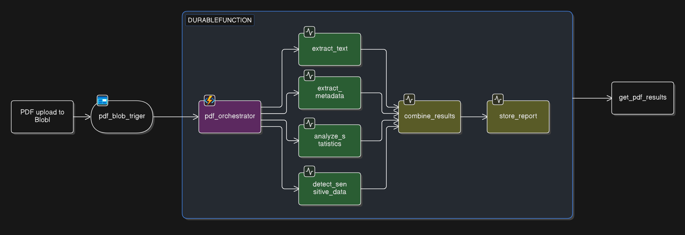

# CST8917 Midterm Project

## Team Members and Contributions

This project was completed as a collaborative team effort by all four members.

| Team Member | Student number | Contributions |
| --- | --- | --- |
| Naveed Hossain | 041081882  | Setting up Cloud infrastrucutre, Durable functions, azure table storage and function http endpoint and azure demo |
| Joshua Chen | 041280453 | Activitiy functions extract_text and extract_metadata, local demo |
| Anoopbir Singh Sidhu | 040984994 | Activity functions analyze_statistics and detect_sensitive_data |
| Corey Mark-Stewart | 040770982 | Activity functions combine_result, store result and Http endpoint funciton get_pdf_result, and the demo video |

All team members participated in planning, implementation, testing, and documentation.

## Setup Instructions

### Prerequisites

- Python 3.11+ (or course-required version)
- Azure Functions Core Tools v4
- Azure Storage emulator (Azurite) if running locally with storage bindings

### 1. Clone and open the project

```powershell
git clone <your-repo-url>
cd CST8917_Midterm
```

### 2. Create and activate a virtual environment

```powershell
python -m venv .venv
.\.venv\Scripts\Activate.ps1
```

### 3. Install dependencies

```powershell
python -m pip install --upgrade pip
python -m pip install -r requirements.txt
```

### 4. Configure local settings

1. Copy `local.settings.example.json` to `local.settings.json` if needed.
2. Set required environment values.

### 5. Run the Azure Function locally

```powershell
func host start
```

### 6. Test the function

Use `test-function.http` (VS Code REST Client) or a REST tool like Postman.

## Architecture Diagram



## Demo Video

[Demo Video](https://youtu.be/H4IyhmiHnwQ)

## AI Disclosure

AI tools (including GitHub Copilot and/or other AI assistants) were used to support parts of this project, such as brainstorming, drafting, and code refinement.

Claude was used to help set up local testing environment (debug some issues setting up the enviroment)
Claude also helped research and debug methods to extract information from pdf files, providing resources on pypdf and debugging issues when using it.

All generated content was reviewed, validated, and edited by team members before submission.
